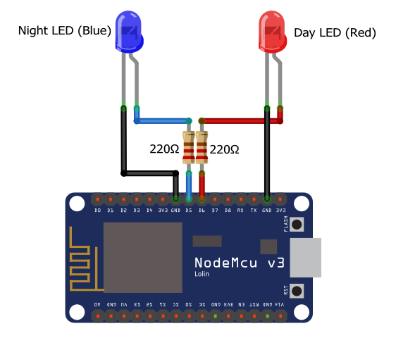
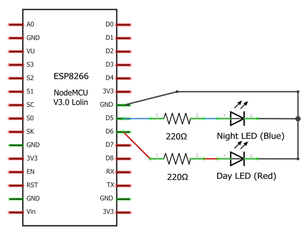

# Rocket Clock

A network connected clock with ESP8266 designed to work with [Laurence Keir's Sleep Training Rocket Clock](https://www.thingiverse.com/thing:3404826).

## How it works

This code connects to the specified time server to retrieve the current time adjusted to your current time zone and daylight saving preferences. Based on the specified time range for day time and night time it turns the appropriate LEDs on or off.

## Getting started

### Hardware

Connect two LEDs (recommended a red LED for day time and a blue LED for night time) to two ESP8266 pins and the Ground pin through 220 Ohm resistors.

If you wish to further improve this wiring you can download the [Fritzing Sketch](./doc/wiring/rocket-clock.fzz) as well.

### Software

Load the project into the Arduino IDE and import the [WiFiManager library](https://github.com/tzapu/WiFiManager).

Update the parameters in the `config.h` file and upload the sketch to your ESP8266.

### Usage

If you have not connected your ESP8266 to the network before, when first boot up it will create a new WiFi network with the parameters specified in `config.h`. By default the network name is `RocketClock`.

Connect to this WiFi network with the password specified in `config.h` (by default `Rocket!`).

Open your favorite web browser and navigate to `http://192.168.4.1`, and configure the WiFi connection. Upon save your device will restart and automatically connect to the specified WiFi network.

## Acknowledgements

Thanks to [Andreas Spiess](https://github.com/SensorsIot) for sharing his [NTP library for ESP8266](https://github.com/SensorsIot/NTPtimeESP), though I have to change his code to make it more reliable.

Thanks to [Roman Minyaylov](https://github.com/roman-minyaylov) for sharing his [NodeMCU Fritzing part](https://github.com/roman-minyaylov/fritzing-parts). I copied the current version of that part into the `.doc/wiring/esp8266-nodemcu-v3` folder.

## About the author

This project is maintained by [György Balássy](https://linkedin.com/in/balassy).

